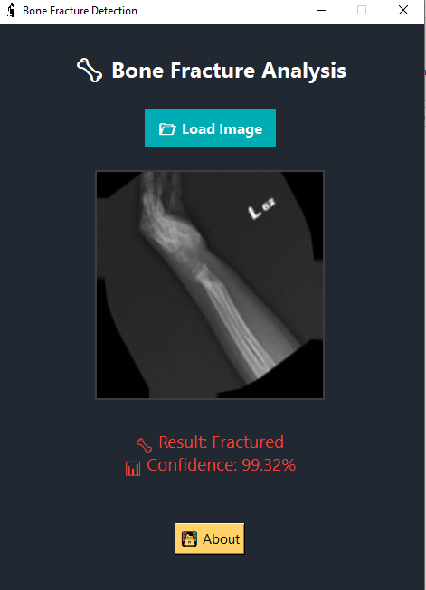
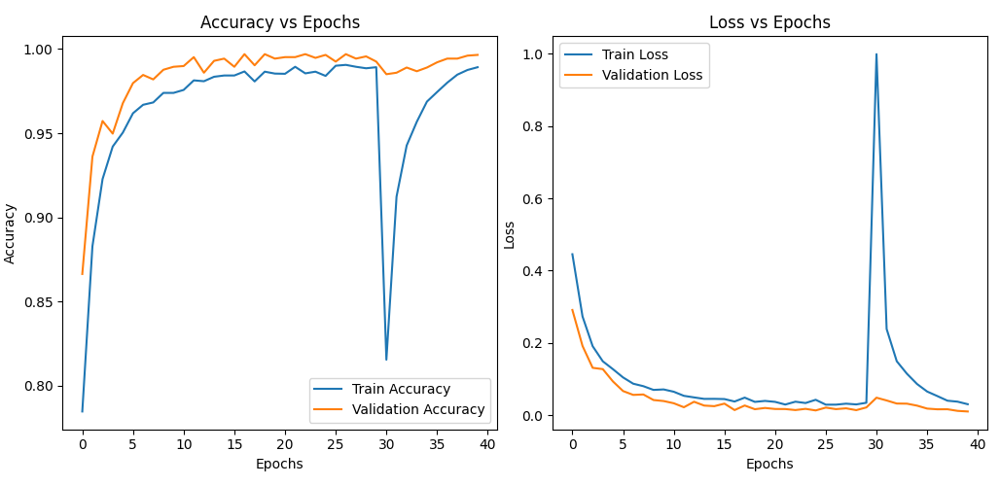

# 🦴 Bone Fracture Detection AI

🔍 A lightweight and intuitive desktop application that uses a deep learning model to detect **bone fractures** from X-ray images. Developed with **TensorFlow** and **Tkinter** for real-time, offline usage.



---

## 🚀 Features

- 🧠 Uses a trained **TensorFlow Keras model**.
- 🖼️ Supports `.jpg`, `.png`, and `.jpeg` images.
- 📊 Provides prediction with **confidence score**.
- 💡 Elegant and modern UI with **Tkinter**.
- 🧾 Developed entirely in **Python**.
- 📌 Offline — no internet required.

---

## 📂 Project Structure

```
📁 fracture-detector/
├── fracture_model.keras
├── trauma.png
├── app.py
├── README.md
├── requirements.txt
└── screenshots/
    ├── app_ui.png
    ├── confusion_matrix.png
    └── accuracy_plot.png
```

---

## 🧠 Model Info

- **Input shape**: `(224, 224, 3)`
- **Classes**:
  - `Fractured`
  - `Not Fractured`
- **Accuracy**: `99.65%`
- **Loss function**: Categorical Crossentropy
- **Optimizer**: Adam

---

## 📸 Screenshots

### 🎯 Confusion Matrix


### 📈 Accuracy Curve



---

## ⚙️ Requirements

Install dependencies via:

```bash
pip install -r requirements.txt
```

### Contents of `requirements.txt`:

```
tensorflow
numpy
Pillow
tk
```

---

## 🖥️ Usage

Run the app using:

```bash
python main.py
```

Then click on `📂 Load Image` and select an X-ray image.

---

## 🛠️ Build to .exe (Optional)

You can convert the app to a standalone `.exe` using **PyInstaller**:

```bash
pyinstaller --onefile --windowed --icon=trauma.ico app.py
```

This will generate a single executable inside the `dist/` folder.

---

## 👨‍💻 Developer

- Bouagal Houssem Eddine  
  📍 Guelma, Algeria  
  💼 Master in Computer Science — Information Systems  
  📧 [Contact Me](mailto:your_email@example.com)

---

## 📃 License

This project is licensed under the MIT License. Feel free to use, modify, and distribute.
